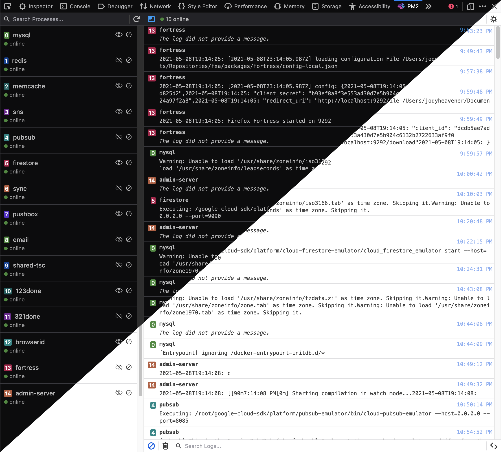

# pm2-devtools

A Firefox web extension for working with [PM2](https://github.com/Unitech/pm2).



PM2 DevTools adds a new Developer Tools panel. Some of its main capabilities include:

- List, filter, and manage running processes. Processes can be started and stopped right in the panel.
- View a live stream of logs. Search by string or regexp, exclude by process.
- Set up scripts that can be executed directly in specific web pages using log data.

## Installation & usage

- Ensure your PM2 services are running.
- [PM2 WebSocket](https://www.npmjs.com/package/pm2-ws) needs to be set up and running in order to receive new PM2 logs.
- Download the extension from [Firefox Add-ons](https://addons.mozilla.org/firefox/addon/pm2-devtools/).
  - Or, get it from the [Releases page](https://github.com/jodyheavener/pm2-devtools/releases), but you'll need to install it from `about:debugging`.
- Once installed you'll see a new Developer Tools PM2 tab. Open that and start exploring.

## Settings

### General

Manage general settings from the top-right corner of the PM2 Developer Tools panel.

#### WebSocket address

The URL where the extension can connect to the PM2 WebSocket Server. Changing this will cause the extension to attempt to re-connect to the WebSocket.

#### Log history count

How many log items to render. All logs are kept in memory until the extension is closed. This setting is mostly for performance as thousands of logs streaming in can slow things down.

#### Automatically start logging

When enabled, logs will start rendering as soon as the WebSocket server is connected. Enable this to allow Log Scripts to be executed in the background (i.e. without the Developer Tools panel open).

### Log Scripts

Manage Log Scripts from the bottom-right corner of the PM2 Developer Tools panel.

Log Scripts are JavaScript snippets that can be executed when PM2 logs are broadcast. When the extension's background script receives a new log event it will check to see if any Log Scripts have matching URLs and then execute the script's code, which will have access to the log's data, directly on the page.

These are the script's options:

#### Enable this Log Script?

This can be used to turn off a Log Script without deleting it. Uncheck and the script will stop executing on the page (after you save).

#### Name

The name of the Log Script. Only used for reference.

#### URL

Which pages should this script run on?

This field is evaluated using [minimatch](https://github.com/isaacs/minimatch), so globs are supported.

#### Code

The code to be executed on the page, evaluated directly in the webpage. Be careful, this really does execute anything.

The `data` object is available in the scope of the function and contains the log payload. You can use information from this, such as process name or ID, to further restrict when code is executed on the page.

<details>
  <summary>See an example log payload:</summary>

```json
{
  "message": "some output from the service",
  "timestamp": 1619810341487,
  "pmId": 15,
  "name": "auth-db"
}
```

</details>

## Development

- Clone the package
- `yarn install` to install dependencies
- `yarn start` to start developing
- `yarn build` build and zip a production package

## License

MPL-2.0
